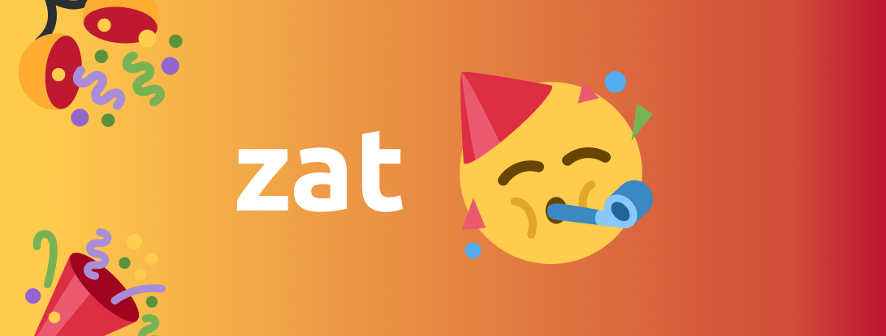

 
  

&#xa0;

  

  

  

  

  <a href="#dart-about">About</a> &#xa0; | &#xa0; 
  <a href="#rocket-technologies">Technologies</a> &#xa0; | &#xa0;
    <a href="#what-i-learned">What I Learned</a> &#xa0; | &#xa0;
  <a href="#memo-license">License</a> &#xa0; | &#xa0;
  <a href="https://github.com/zambonil" target="_blank">Author</a>

 

## :dart: About

Zat is a chat webapp where you can start conversations with your friends or in groups built on NextJS with a Node/Express backend and socket.io for real time interactions.

## :rocket: Technologies

The following tools were used in this project:

**Back-End:**

- [Node.js](https://nodejs.org/en/)
- [Socket.io](https://socket.io/)
- [Mongodb](https://www.mongodb.com/)

  **Front-End**

- [React](https://pt-br.reactjs.org/)
- [Nextjs](https://nextjs.org/)
- [Styled-Components](https://styled-components.com/)
- [Google Cloud Storage](https://cloud.google.com/storage?)

## What I learned

This project was huge for me, in scope and in lessons that I will certainly remember on my next project, if I had to break it down to a couple points it would be:

- Better planning
- Aiming for a realistic scope
- How to better structure my work
- A METRIC TON of React and NextJS, hours and hours of studying and trying on hand
- The importance of the rendering method on each of my pages
- General API usage and structure both from the frontend and backend
- AUTH AUTH AND AUTH On the starting phase of this project I had a real problem with authentication, so I researched a ton to finally figure the theory out
- At the last second I also had to learn how to use google cloud for file storage needs

With all that I would say this project was certainly worth it and really fun to work on

## :memo: License

This project is under license from MIT. For more details, see the [LICENSE](LICENSE.md) file.

Made with :heart: by <a href="https://github.com/zambonil" target="_blank">Lucas Zamboni Orioli</a>

&#xa0;

<a href="#top">Back to top</a>
